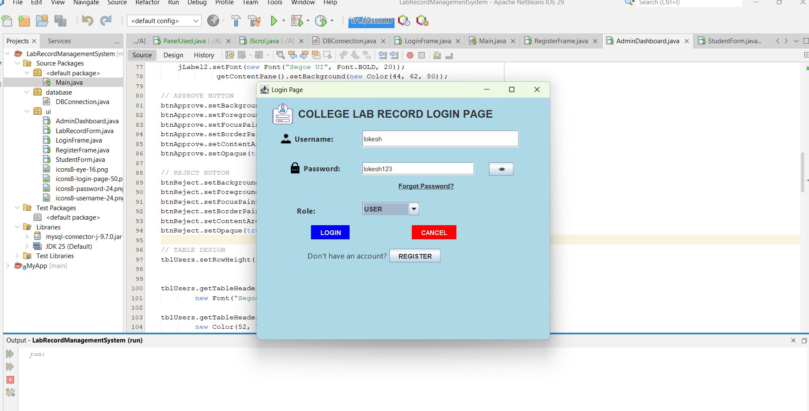
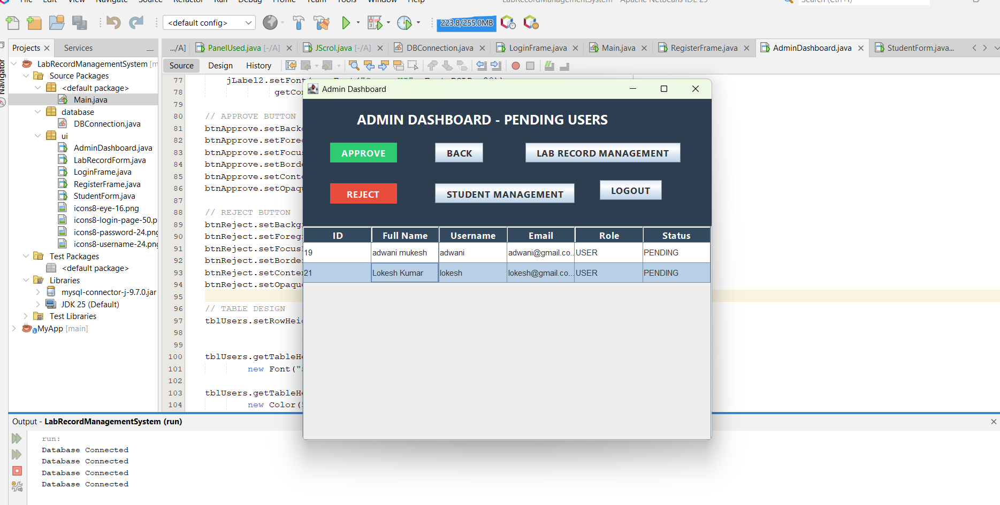
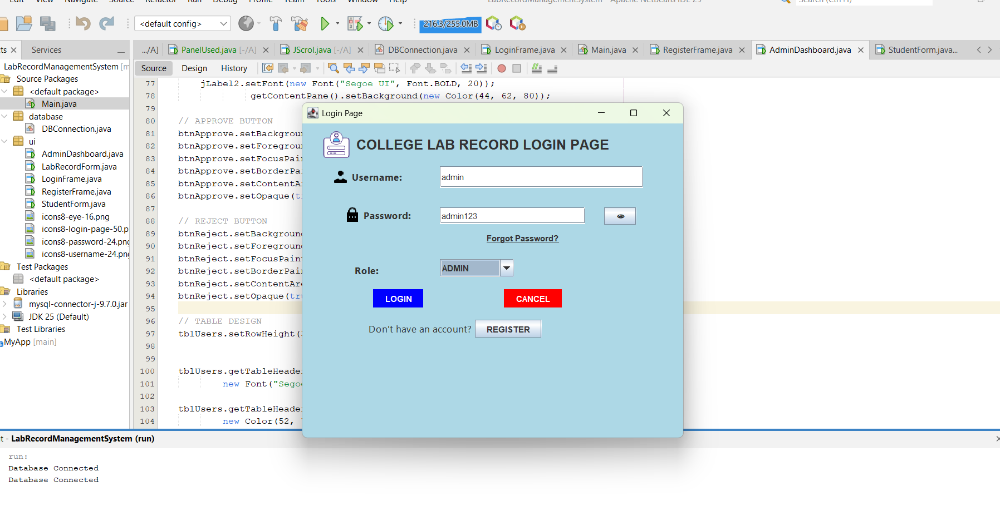
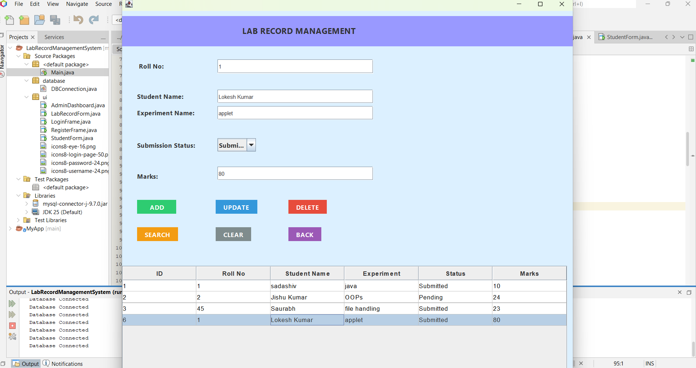
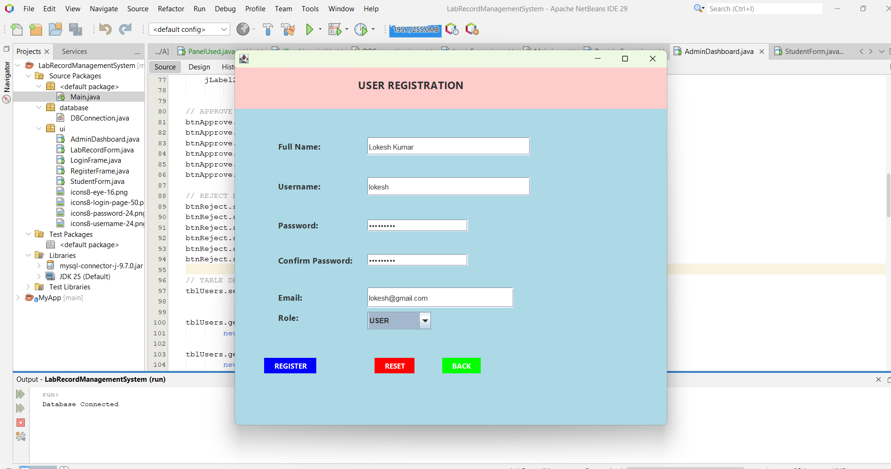
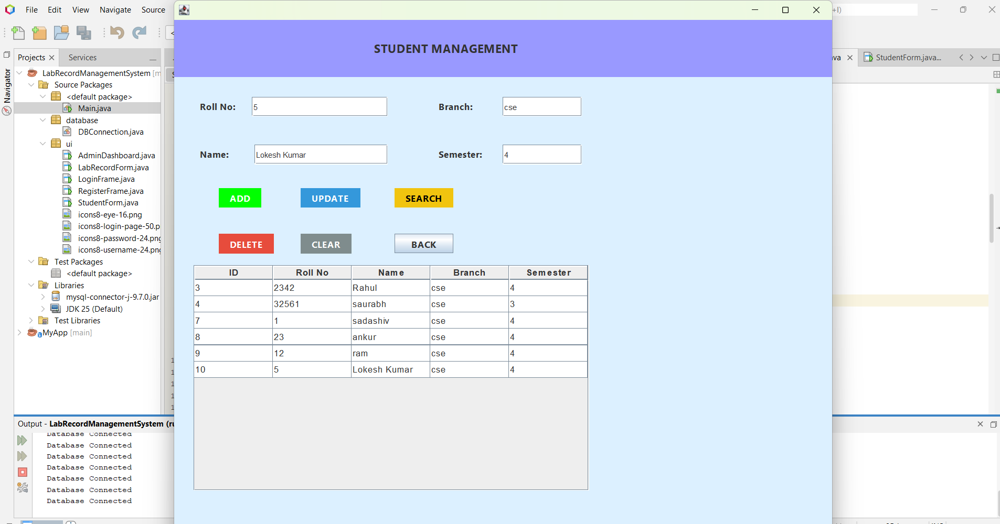

# Lab Record Management System

A Java Swing based desktop application developed for managing student laboratory records efficiently. The project provides a user-friendly graphical interface for handling student data, authentication, and record management using MySQL database connectivity.

---
## Screenshots

### Login Page

### Dashboard

### admin Login

## Screenshots

### LabRecord 

### Dashboard

### registration

## Screenshots

### Student management

## Project Structure

### Source Packages

#### Main.java
Main entry point of the application.

---

### database Package

#### DBConnection.java
Handles JDBC database connection between Java application and MySQL database.

---

### ui Package

#### AdminDashboard.java
Admin panel/dashboard for managing records and system operations.

#### LabRecordForm.java
Form for adding and managing laboratory records.

#### LoginFrame.java
User login interface for authentication.

#### RegisterFrame.java
Registration form for creating new user accounts.

#### StudentForm.java
Form for managing student information and records.

---

## Features

- Student Record Management
- User Login and Registration System
- Add, Update, Delete Records
- Java Swing GUI Interface
- JDBC Database Connectivity
- MySQL Database Integration
- Admin Dashboard
- User-Friendly Design

---

## Technologies Used

- Java
- Java Swing
- JDBC
- MySQL
- Apache NetBeans IDE

---

## Libraries Used

- mysql-connector-j-9.7
- JDK 25

---

## How to Run the Project

1. Open the project in Apache NetBeans IDE
2. Configure MySQL database
3. Update database username and password in DBConnection.java
4. Import required database tables
5. Run Main.java

---

## Learning Outcomes

Through this project, I learned:

- Java Swing GUI Development
- JDBC Connectivity
- MySQL Database Management
- CRUD Operations
- Event Handling in Java
- Project Structure in NetBeans
- Git and GitHub Workflow

---

## Future Improvements

- Export Records to PDF/Excel
- Attendance Management
- Improved Dashboard Analytics
- Role-Based Authentication
- Cloud Database Integration

---

## Author

Saurabh Kumar  
B.Tech CSE Student

---

## GitHub Repository

https://github.com/tech-saurabh2005/LabRecordManagementSystem
